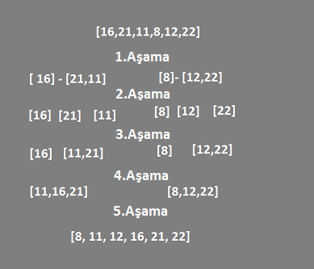

# Merge-sort
## [16,21,11,8,12,22]

## Yukarıdaki dizinin sort türüne göre aşamalarını yazınız.

## Big-O gösterimini yazınız.

 2^x=n (n sayısı dizideki eleman sayısını vermektedir.)

logn=x (x sayısı bölünme miktarını vermektedir.)

Big O(n.logn) 
